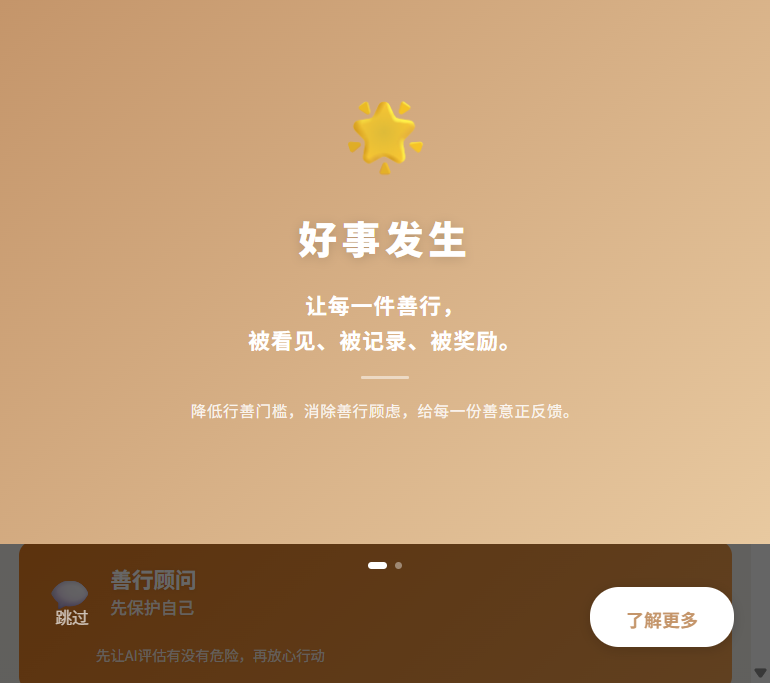
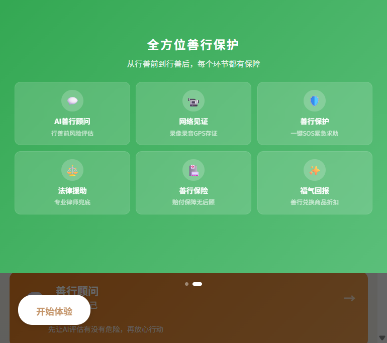
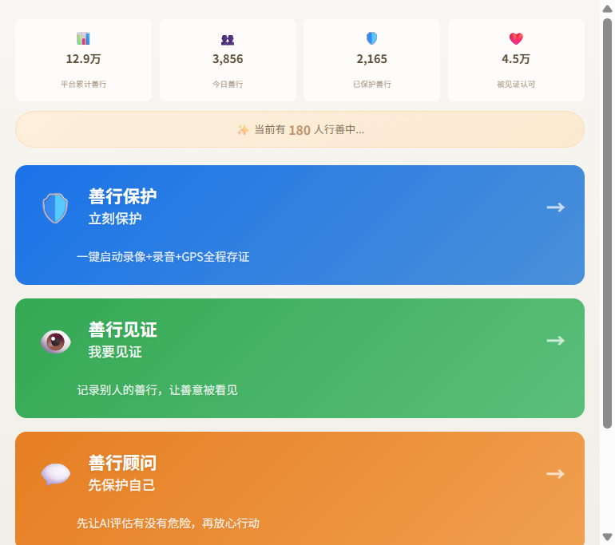
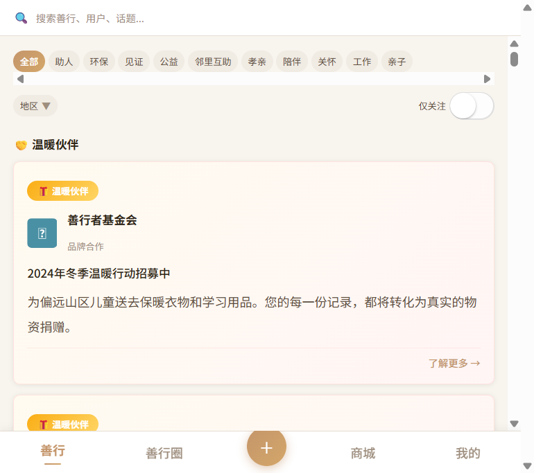
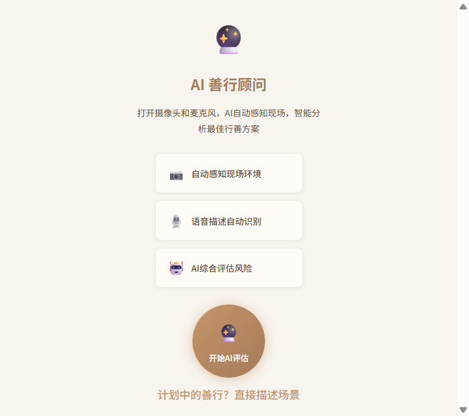
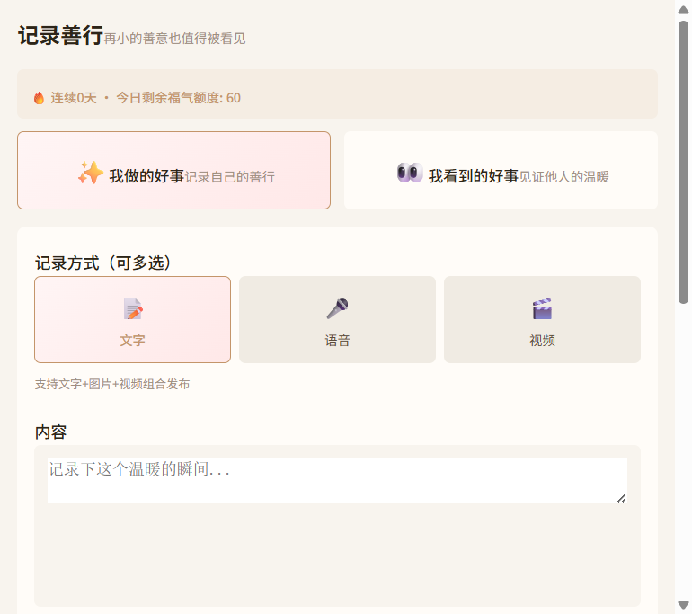
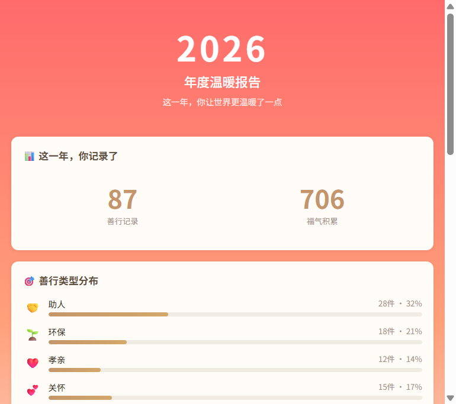
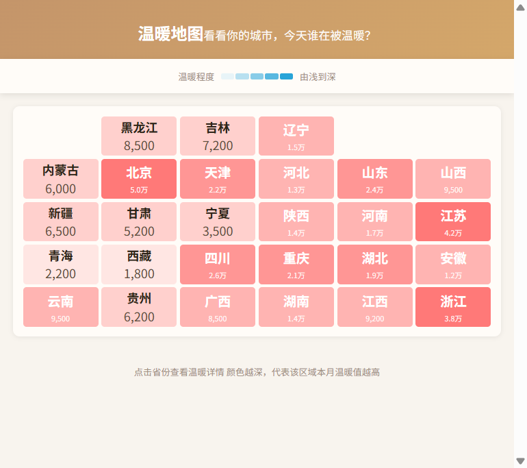
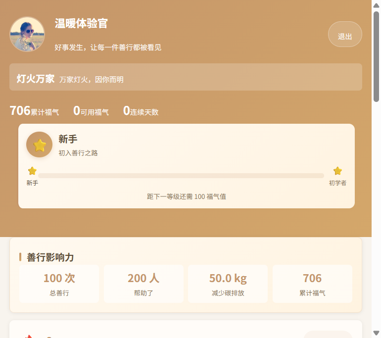

# Demo 作品帖子

### 🏷️ 标签：#Taro  #React  #TypeScript  #AI助手  #社交  #校园  #公益

---

## 🎉 大家好，我们组终于完成作品啦！

作为不懂技术的小白，**完全靠 TRAE 一句话一句话做出来的**。

在做这个项目的过程中，我深深感受到 AI 时代已经到来，有了 TRAE 这样的 AI IDE，真的不需要会编程也能做出一个完整的产品。以前觉得做 App 是程序员的事，现在普通人也能实现了。

只要你能把需求说清楚，TRAE 就能帮你写代码、改 bug、优化界面。

---

## 📱 Demo 简介

**「好事发生」—— 让每一件善行都被看见、被保护、被奖励**

🔗 **体验地址**：https://goodhappen-d7gjsyvoy48c5c52f-1255365603.tcloudbaseapp.com

> 🎮 **演示模式说明**：当前为游客自动登录模式，打开即可直接体验所有功能，无需注册。

---

### 🌟 这是什么？

「好事发生」是一个**善行者互助平台**。

这不是一个简单的"好人好事记录本"，而是一套**完整的善行保护生态系统**。

我们相信：善良不应该有门槛，行善不应该有顾虑。

---

### 🎯 面向谁？

- 想做善事但担心被讹的普通市民
- 想培养孩子品德的家长和老师
- 想组织公益活动的志愿者团队
- 学校德育工作的老师和学生
- 关注社会正能量传播的每一个人

---

### ✨ 核心功能（已实现）

#### 1. AI 善行顾问 —— 行善前帮你评估风险

不确定眼前的情况该不该帮？先问 AI。

系统内置 **8 位 AI 历史人物**（苏东坡、李白、鲁迅、王阳明等），根据你描述的场景给出风险评估和行动建议。

**核心创新**：不是简单的问答，而是基于场景的危险系数评估 + 具体行动建议 + 保护模式一键联动。

#### 2. 善行保护模式 —— 行善中全程守护

一键开启保护，系统自动：

- 📹 **录像存证**：全程视频记录
- 🎙️ **录音存证**：音频备份
- 📍 **GPS 追踪**：实时位置记录
- 🆘 **一键 SOS**：紧急求助 + 自动通知紧急联系人
- 📁 **证据自动归档**：时间、地点、音视频、GPS 轨迹完整保存

**解决了什么问题？** 做好事前被讹诈、被反咬一口的担忧。

#### 3. 网络见证人 —— 让善行有据可查

行善时开启"见证模式"，自动召唤网络见证人围观，形成第三方证据链。

#### 4. 法律援助 + 善行保险 —— 行善后兜底保障

- ⚖️ **法律援助**：专业律师团队，万一被讹有人帮你打官司
- 🏥 **善行保险**：赔付保障，消除后顾之忧

#### 5. 温暖地图 —— 看见身边的善意

在地图上看到周围发生的善行，找到志同道合的善人。

#### 6. 善行圈 —— 社交化行善

创建或加入兴趣圈子（社区互助、环保志愿、校园公益等），和志同道合的人一起行善。

#### 7. 福气值体系 —— 让善良成为流通货币

- 记录善行 → 积累福气值
- 福气值可兑换 **折扣券、公益商品**
- 10 级成长体系，可视化成就

#### 8. 年度温暖报告 —— 你的善意年度报告

记录你一年中的温暖瞬间，生成专属年度报告。

#### 9. 善行圈（校园版）—— 德育工作神器

- 老师发布任务，学生提交善行
- 班级看板、榜样墙、个人档案
- 让德育从"说教"变成"行动"

---

### 🎨 界面展示

#### 引导页 —— 品牌 Slogan



**让每一件善行，被看见、被记录、被奖励。**

#### 引导页 —— 全方位善行保护



**从行善前到行善后，每个环节都有保障。**

#### 首页 —— 善行记录入口



三大核心入口：
- 📝 **记录善行**：事后发布已做过的善事
- 📷 **我要见证**：现场打开摄像头，实时拍照录像 + GPS 存证
- 🛡️ **善行保护**：一键开启全程保护模式

#### 发现页 —— 功能广场



底部 Tab 设计（善行 · 善行圈 · [+]发布 · 商城 · 我的），中间大大的 + 号像抖音一样醒目，一键发布善行。

#### AI 善行顾问



输入场景，AI 历史人物给你风险评估和行动建议。

#### 记录善行



事后发布已做过的善事，支持文字、图片、视频、标签、位置。

#### 年度报告



生成你的专属年度温暖报告。

#### 温暖地图



在地图上看到身边的善意。

#### 个人中心



福气值、善行数、关注、徽章、等级成长体系。

---

## 💡 创作思路

### 灵感来源

做了一个问卷，问身边的人："你为什么不敢扶老人？"

回答出奇一致：**"怕被讹。"**

这引发了我的思考：为什么社会越来越冷漠？不是因为人变坏了，而是因为"行善的成本太高了"。

做好人，可能要面对：
- 被反咬一口的风险
- 没有证据百口莫辩
- 打官司花时间花钱
- 做了好事没人知道，没有正向反馈

### 我们想解决的问题

**让行善从"高风险行为"变成"零门槛日常"。**

### 差异化与创新点

| 普通行善平台 | 好事发生 |
|-----------|---------|
| 只能事后记录 | **事前** AI 评估 + **事中** 全程保护 + **事后** 法律援助 |
| 文字记录为主 | 支持**实时拍照、录像、GPS 存证** |
| 没有保护机制 | **一键 SOS + 网络见证人 + 证据链自动归档** |
| 做了就做了 | **福气值奖励 + 商城兑换**，让善良有回报 |
| 单打独斗 | **善行圈社交**，找到志同道合的善人 |

### 核心价值主张

**"降低行善门槛，消除行善顾虑，给每一份善意正反馈。"**

---

## 🚀 TRAE 实践过程

### 开发环境

- **AI IDE**：TRAE（字节跳动旗下 AI 编程工具）
- **框架**：Taro 3.x + React + TypeScript
- **状态管理**：Zustand
- **样式**：SCSS + CSS Variables
- **部署**：腾讯云 CloudBase 静态托管

### 开发流程

整个项目完全通过 **TRAE 对话式编程** 完成：

1. **需求描述** → 我把产品需求用自然语言描述给 TRAE
2. **代码生成** → TRAE 自动生成 Taro 页面组件、Store、API 接口
3. **界面调整** → "这个按钮太丑了，换成圆角的"、"颜色不对，用暖金色"
4. **Bug 修复** → 运行报错直接把错误信息贴给 TRAE，自动修复
5. **功能迭代** → "再加一个善行保护模式"、"底部 Tab 要类似抖音的 + 号"

### 关键功能实现

#### AI 善行顾问

通过 TRAE 快速搭建了基于规则 + 模板匹配的 AI 顾问系统，支持 8 位历史人物角色，根据场景类型给出差异化建议。

#### 善行保护模式

TRAE 帮我实现了完整的状态机：

```
idle → starting → active → paused / sos → closed
```

每个状态都有对应的 UI 和逻辑，包括摄像头控制、GPS 追踪、录音录像、SOS 倒计时等。

#### 现场见证（摄像头 + GPS）

实现了 H5 端 `getUserMedia` + 小程序端 `Camera` 组件的双平台适配，支持实时拍照、录像、GPS 定位。

### 开发效率

- **总开发时间**：约 2 周
- **生成代码量**：约 15,000+ 行
- **页面数量**：20+ 个完整页面
- **关键认知**：AI IDE 让非技术人员也能做出专业级产品

---

## 🔗 体验地址

**CloudBase 永久链接**：

👉 https://goodhappen-d7gjsyvoy48c5c52f-1255365603.tcloudbaseapp.com

> 当前为演示模式，打开即可直接体验，无需注册登录。

---

## 📋 对应报名审核通过的帖子链接

https://build.trae.ai/app/share?chatID=42c4dd105c5d409083e6523e5c9d4554&skillID=eb795c23b65048f296365a3873908cd5

---

## 🙏 写在最后

感谢 TRAE 让不懂技术的我也能做出一个完整的产品。

在这个 AI 时代，**技术不再是门槛，想法才是**。

希望「好事发生」能让这个世界多一点点温暖。

**让每一件善行，都被看见。**
